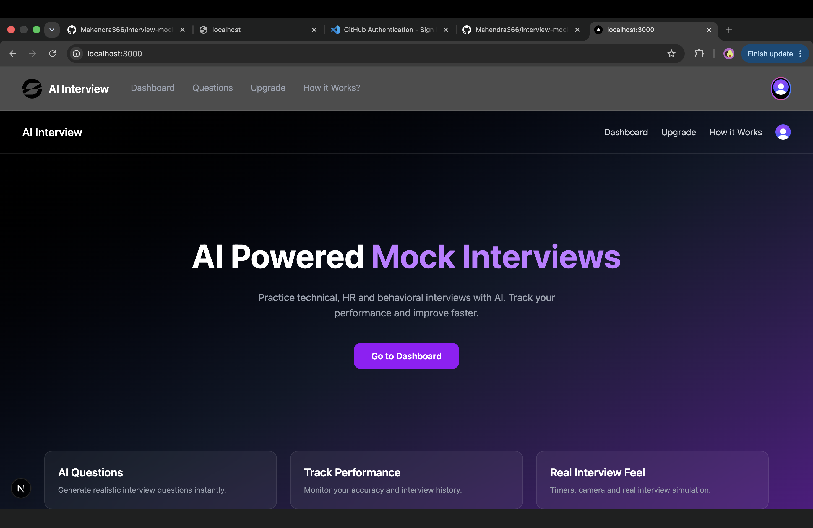
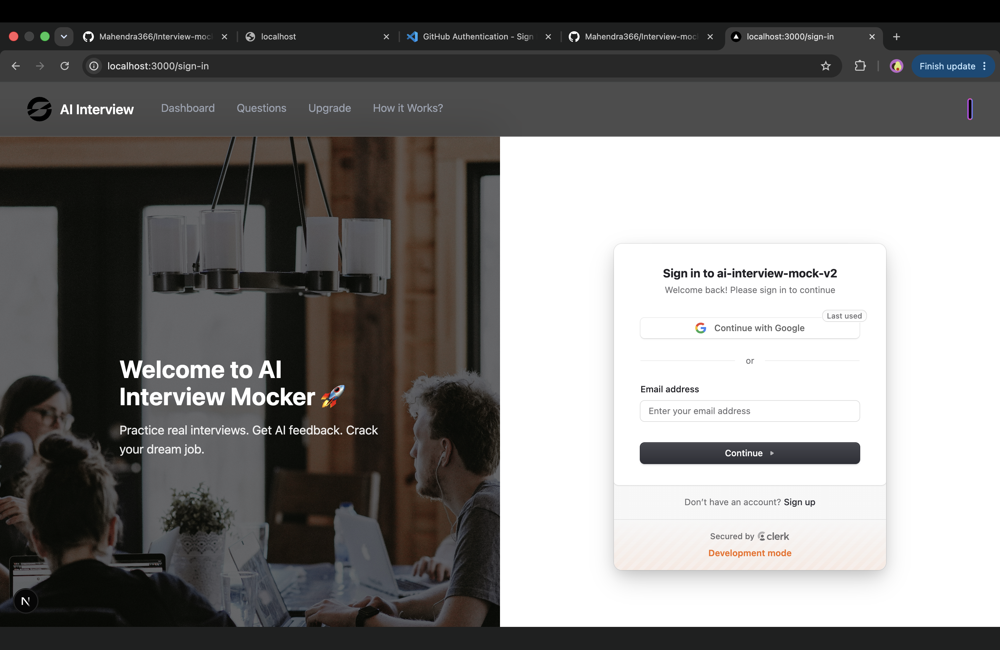
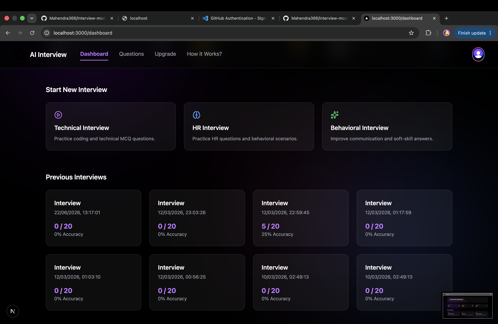
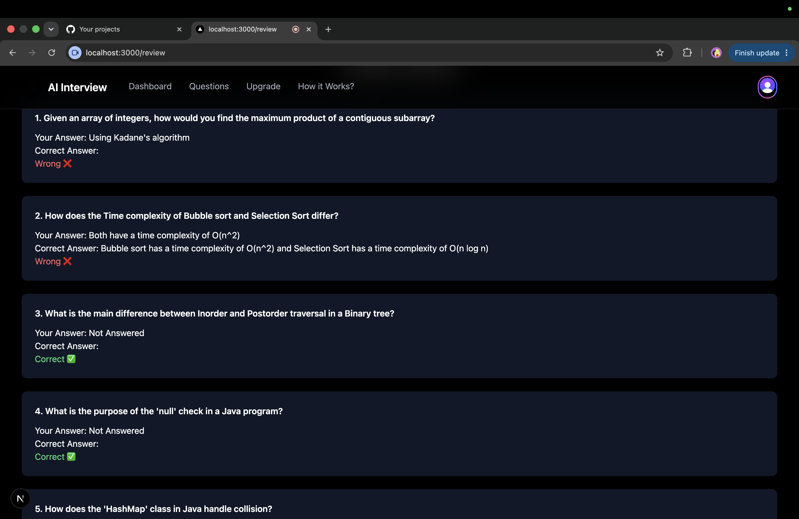
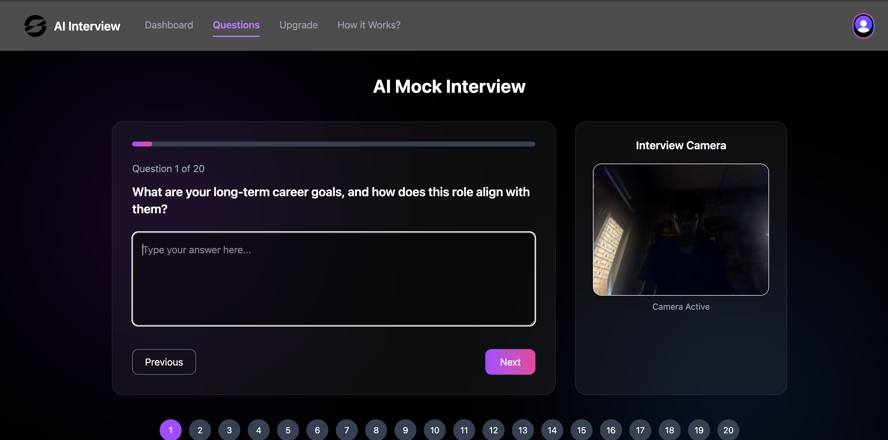

# AI Interview Mocker

AI-powered interview preparation platform that simulates real interview experiences using Google Gemini AI.

## Features

- AI-generated interview questions
- Camera and microphone integration
- Speech-to-text conversion
- Gemini AI-powered evaluation
- Detailed feedback and scoring
- Interview history tracking
- Role-based interview generation

## Tech Stack

- Next.js
- React
- Tailwind CSS
- Gemini AI
- Clerk Authentication
- Drizzle ORM
- PostgreSQL

## Screenshots

### Home Page

### Login Page

### Results Page

### Interview Page

### Additional Screen

